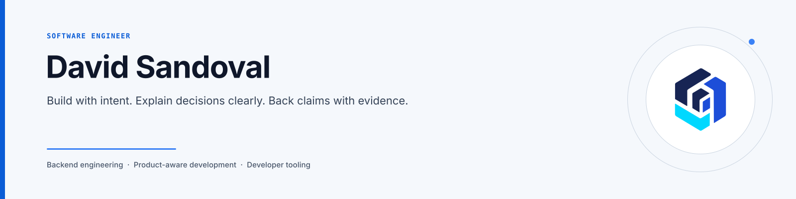

<picture>
  <source media="(max-width: 600px) and (prefers-color-scheme: dark)" srcset="./assets/brand/github-profile-header-mobile-dark.svg">
  <source media="(max-width: 600px) and (prefers-color-scheme: light)" srcset="./assets/brand/github-profile-header-mobile-light.svg">
  <source media="(max-width: 600px)" srcset="./assets/brand/github-profile-header-mobile-light.svg">
  <source media="(prefers-color-scheme: dark)" srcset="./assets/brand/github-profile-header-dark.svg">
  <source media="(prefers-color-scheme: light)" srcset="./assets/brand/github-profile-header-light.svg">
  
</picture>

# Hi, I'm David 👋

I'm a **Software Engineer from Peru**, working remotely on fintech software since January 2026.

Most of my day-to-day work is backend-oriented with **.NET and C#**, but I also work across **Angular and TypeScript** when a problem crosses the product. What I enjoy most is the investigation behind a good fix: tracing assumptions, narrowing a bug to the right layer, making contracts explicit, and validating that the behavior really changed.

[Portfolio](https://sandovaldavid.com) · [LinkedIn](https://www.linkedin.com/in/jdsandovals) · [Link hub](https://hub.sandovaldavid.com) · [Email](mailto:hello@sandovaldavid.com)

## What I do at work

### Atena — Jr. Software Engineer

Since January 2026, I've been building and maintaining fintech software with .NET/C# and Angular/TypeScript.

My work has included debugging behavior across layers, tightening authorization boundaries, coordinating contract changes between services, and validating fixes with tests, compiler feedback, and static analysis. The company code is private, so I keep the details sanitized and focus here on the engineering patterns I can discuss responsibly.

## Selected engineering work

### [Kioku](https://github.com/sandovaldavid/kioku)

A local-first .NET MCP server for preserving, retrieving, and updating structured knowledge in Obsidian vaults across AI-agent sessions.

I maintain the project across MCP contracts, retrieval, testing, security boundaries, CI/release automation, and technical documentation.

[Repository](https://github.com/sandovaldavid/kioku) · [Documentation](https://kioku.sandovaldavid.com) · [Releases](https://github.com/sandovaldavid/kioku/releases)

### [OCI ARM Hunter](https://github.com/sandovaldavid/oci-arm-hunter)

A Bash automation tool that retries Oracle Cloud ARM Always Free capacity, rotates Availability Domains, adds jitter between attempts, and supports unattended execution with notifications.

It is a smaller project than Kioku, but it shows another side of my work: turning an annoying operational problem into a reproducible tool.

[Repository](https://github.com/sandovaldavid/oci-arm-hunter) · [Documentation](https://oci.sandovaldavid.com)

### Also building: Yukidoke

Yukidoke is a private household personal-finance product with a modular .NET API and an Angular client. It is currently in active V1 hardening, so I use it as private product/architecture practice rather than presenting it as a finished public product.

## How I approach engineering

- I try to understand the assumption behind a bug before I touch the fix.
- I use compiler/type feedback, tests, and static analysis to find hidden consumers and make changes easier to reason about.
- When new evidence contradicts my first conclusion, I change the conclusion instead of forcing the evidence to fit it.
- I write down useful decisions and lessons so the next investigation starts with more context.

## Current toolkit

`C# / .NET` · `Angular / TypeScript` · `APIs` · `MCP` · `relational & document data` · `automated testing` · `CI/CD` · `containers` · `Bash`

The tools change over time. The part I want to keep improving is the reasoning: understanding constraints, making trade-offs explicit, and building software that is easier to change safely.

## Beyond the code

I'm currently finishing my thesis, building open-source tools, improving my English, and preparing for international opportunities.

Away from engineering, you'll usually find me around books, Japanese culture, music, or games.

## Say hello

If you're reviewing my GitHub after seeing my profile or application, the best place to get the full picture is my [portfolio](https://sandovaldavid.com). You can also reach me on [LinkedIn](https://www.linkedin.com/in/jdsandovals) or at [hello@sandovaldavid.com](mailto:hello@sandovaldavid.com).
